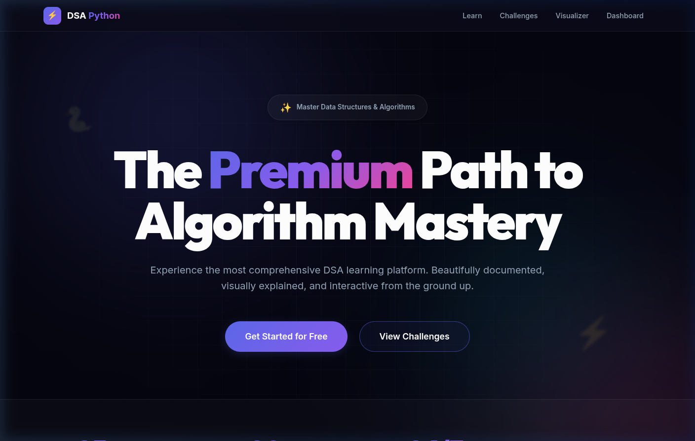
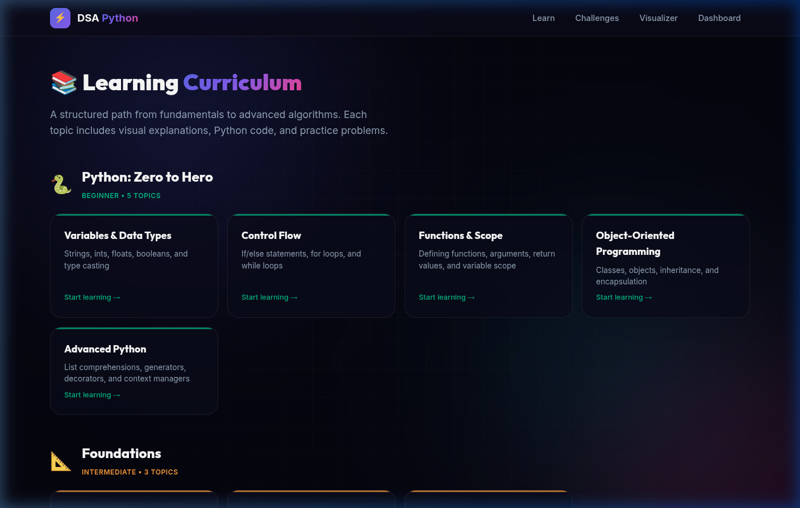
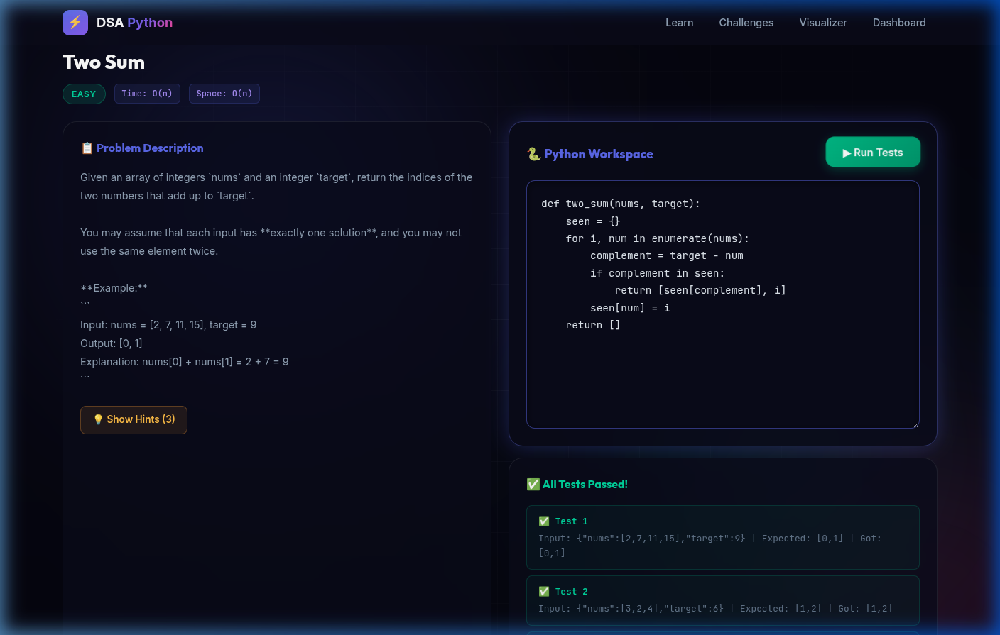

<div align="center">           

# ⚡ DSA Python

### Master Data Structures & Algorithms — The Visual & Interactive Way

[](LICENSE)
[](https://python.org)
[](https://nextjs.org)
[](#-running-tests)

*An elite open-source platform designed to transform your understanding of DSA through high-fidelity visual explanations, multiple Python implementations, and a professional-grade challenge workspace.*

</div>

---

## 🎨 Premium Experience



---

## ✨ Features

| Feature | Description |
|---------|-------------|
| 🧬 **Quad-Implementation Mastery** | Every topic includes 4 distinct Python solutions (Iterative, Recursive, Parallel, Optimized). |
| 📊 **Elite Algorithm Visualizer** | Step-by-step animated sorting with a sleek, dark-mode glassmorphism UI. |
| 🐍 **Deep-Dive Curriculum** | 31+ modules covering everything from Big O basics to Advanced Segment Trees. |
| 🎯 **Interactive Challenges**| Industry-standard coding environment with real-time grading and helpful hints. |
| 📈 **Elite Dashboard** | Monitor your mastery progress across foundations, DS, and complex algorithms. |
| ⚡ **FastAPI Powered** | Blazing fast backend engine for code execution and content delivery. |

---

## 🏗️ Architecture

```text
DSA_python/
├── 🐍 algorithms/          # Core Logic Library
├── ⚡ api/                  # FastAPI Backend Engine
├── 🎯 challenges/           # Challenge definitions & test suites
├── 📖 content/              # Master-level Markdown curriculum (Wave 5)
├── 🎨 frontend/             # Next.js 15 + Tailwind CSS + Glassmorphism
└── 📁 assets/screenshots    # High-fidelity project visuals
```

---

## 📚 Curriculum Deep-Dive



### 🟢 Phase 1 — Foundations & DS
- **Asymptotic Analysis**: Big O, Time & Space metrics.
- **Linear Structures**: Elite Arrays, Doubly Linked Lists, Thread-safe Stacks/Queues.
- **Hierarchical Structures**: AVL Trees, Heaps, Priority Queues.

### 🟡 Phase 2 — Algorithms
- **Sort & Search**: Heap Sort, Quick Sort, Binary/Interpolation Search.
- **Optimization**: Dynamic Programming (Bitmask/Rolling), Greedy Strategies.
- **Graph Theory**: BFS/DFS, Dijkstra, Bellman-Ford, A* Search.

### 🔴 Phase 3 — Advanced Systems
- **Strings & Ranges**: Tries, Segment Trees, Fenwick Trees.
- **FastAPI Ecosystem**: RESTful design, Dependency Injection, Pydantic Mastery.

---

## 🧪 Industrial Challenge Workspace



- **Execution Sandbox**: Subprocess-based secure environment.
- **Live Feedback**: Instant grading against comprehensive test cases.
- **Guided Learning**: Progressive hints for every challenge.

---

## 🚀 Getting Started

### 1. Requirements
- Python 3.10+
- Node.js 18+

### 2. Setup
```bash
git clone https://github.com/the-shadow-0/DSA-Python.git
cd DSA-Python

# Install Backend
pip install -r api/requirements.txt

# Install Frontend
cd frontend && npm install
```

### 3. Launch
```bash
# Terminal 1: API
cd api && uvicorn main:app --port 8000

# Terminal 2: UI
cd frontend && npm run dev
```

---

## 📄 License
Licensed under the [MIT License](LICENSE).

---

<div align="center">
  
### ⭐ Star this repo if it helps you master Pythonic DSA!
  
### Built with ❤️ for the developer community • Open Source
  

</div>

